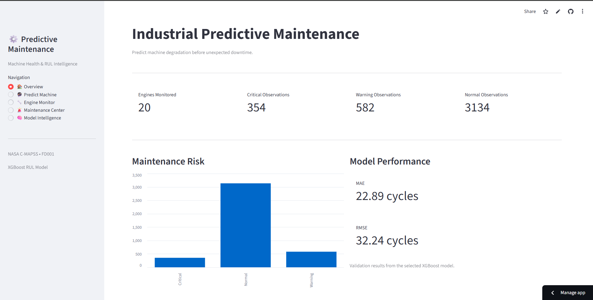
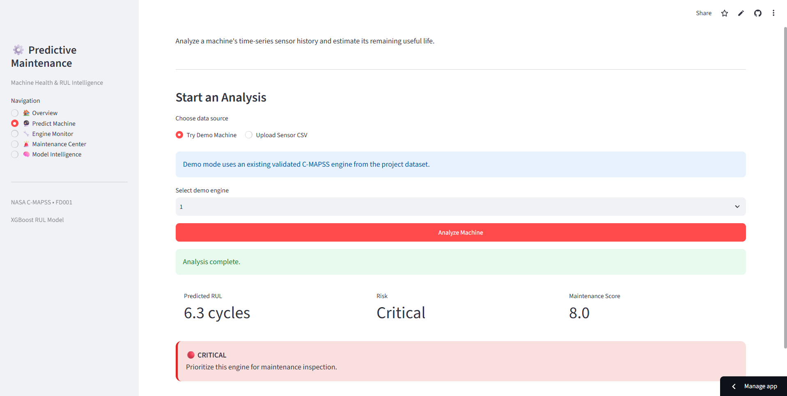
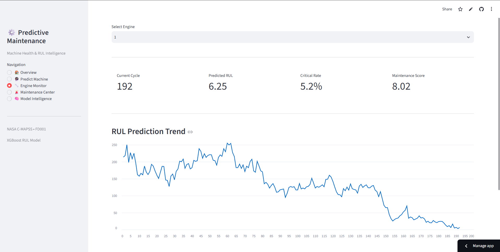
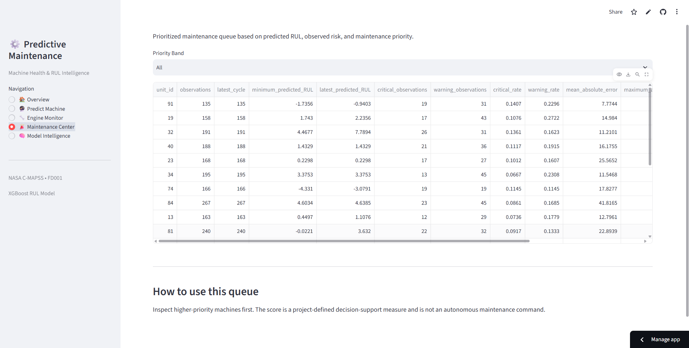
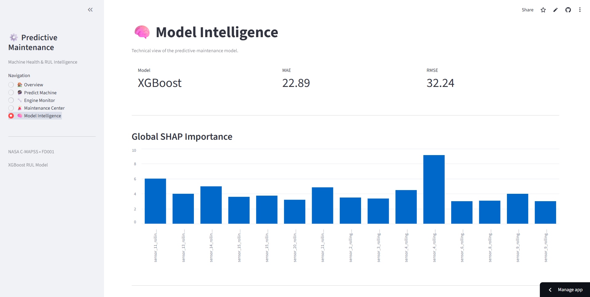

# Industrial Predictive Maintenance & Failure Prevention Intelligence Platform

An end-to-end machine learning system for predicting **Remaining Useful Life (RUL)** of industrial engines and supporting maintenance decisions using sensor time-series data.

The project uses NASA's **C-MAPSS Turbofan Engine Degradation Simulation Dataset (FD001)** and combines time-series feature engineering, XGBoost regression, SHAP explainability, risk classification, and maintenance prioritization into an interactive Streamlit dashboard.

## 🚀 Live Demo

**Live Application:**  
https://industrial-predictive-maintenance-m.streamlit.app/

**GitHub Repository:**  
https://github.com/priyam200409/Industrial-predictive-maintenance


---

## 🖥️ Dashboard Preview

### Overview



### Predict Machine



### Engine Monitor



### Maintenance Center



### Model Intelligence



---

## 🎯 Project Objective

Industrial machines gradually degrade before failure. Unexpected failures can lead to:

- Production downtime
- Increased maintenance costs
- Equipment damage
- Operational disruption
- Unplanned maintenance

This project aims to help maintenance teams answer:

1. How much useful life does a machine have remaining?
2. Which machines are showing higher degradation risk?
3. Which machines should be inspected first?
4. Which sensor features are influencing the RUL prediction?
5. How accurately can machine degradation be estimated?

---

## 🧠 System Overview

```text
NASA C-MAPSS Sensor Data
          │
          ▼
     Data Loading
          │
          ▼
    Data Validation
          │
          ▼
 Engine-aware RUL Generation
          │
          ▼
 Constant Sensor Filtering
          │
          ▼
 Time-Series Feature Engineering
          │
          ├── Rolling Mean
          ├── Rolling Standard Deviation
          └── Degradation Delta Features
          │
          ▼
   Engine-level Train/Validation Split
          │
          ▼
      XGBoost RUL Model
          │
          ▼
      RUL Prediction
          │
          ├───────────────┐
          ▼               ▼
    Risk Analysis      SHAP
          │               │
          ▼               ▼
 Maintenance Priority  Explainability
          │
          ▼
    Streamlit Dashboard
